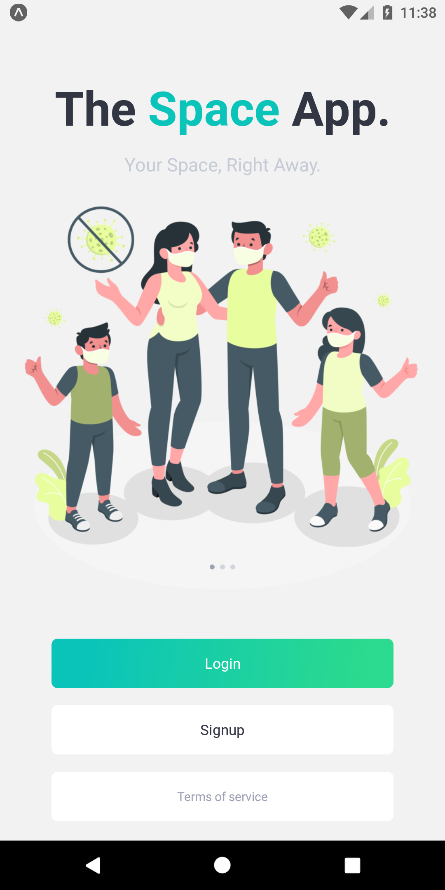
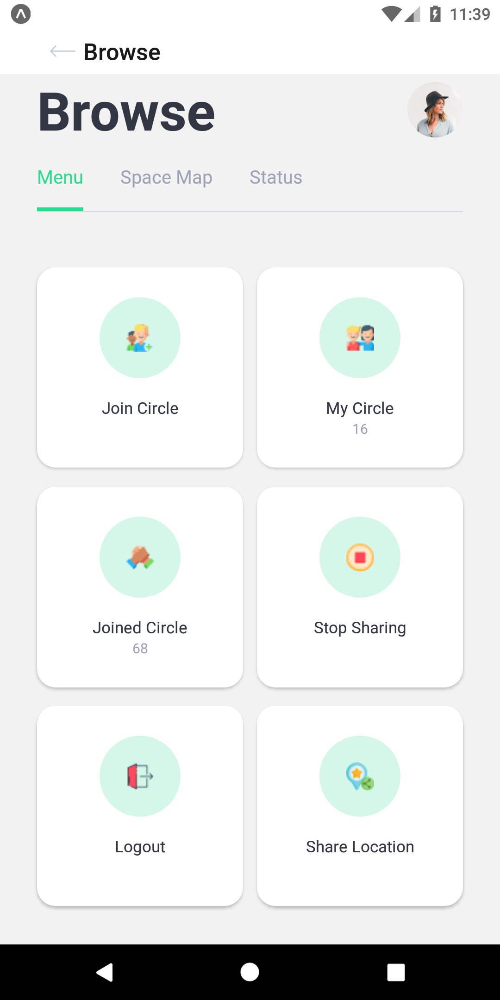
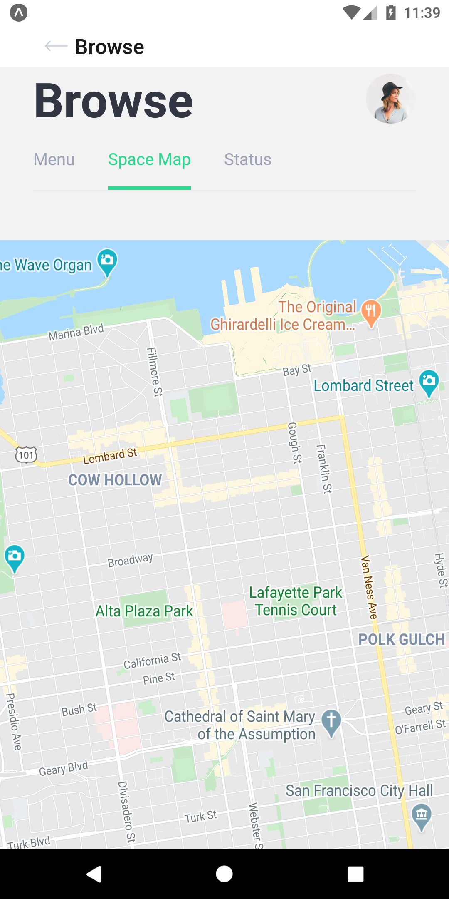
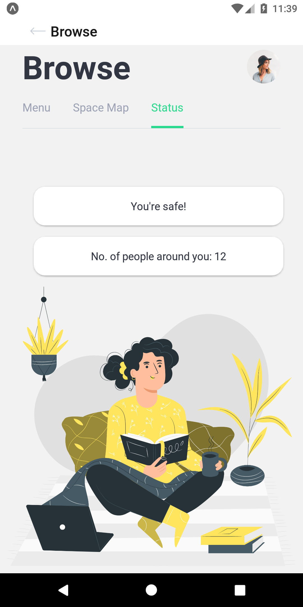
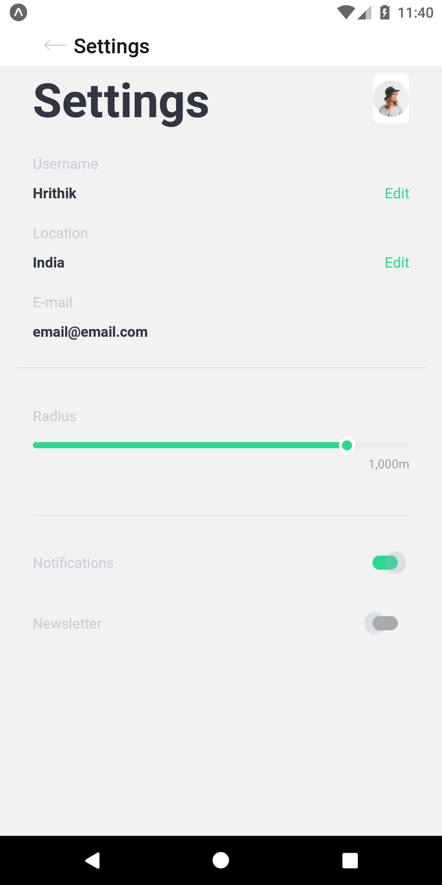
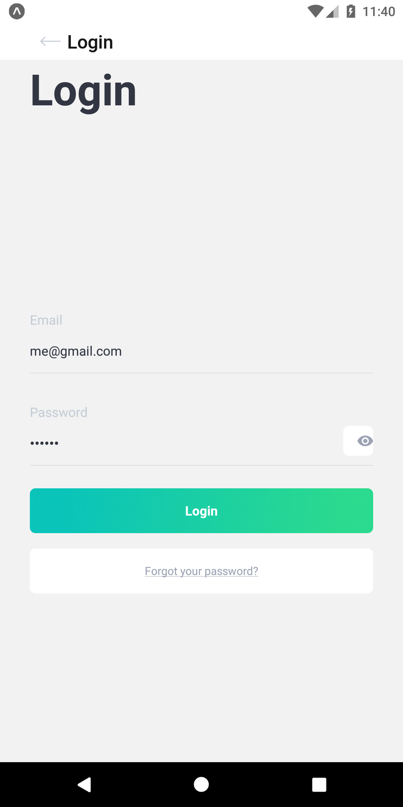

# TheSpaceApp-2.0
The Space App 2.0 is an upgraded version of TheSpaceApp. Its an cross-platform application written in react-native which helps people practice social-distancing in this COVID-19 pandemic.The app uses the Google Maps API to determin distance between two users and Google Firebase to read and write data their distance, latitude, longitude, and status from cloud. With the help of multi-threadin the app refresh itself automatically every 10 minutes. This app helps user keep an eye on the head count within user's 1.5m radius and a haptic feedback is generated if the limit exceeds giving users instant feedback.

    

    

    

The app is still in its development phase. Users current location needs to fetched and stored in the firebase.Apart from that I am planning to implement Haversine formula (https://github.com/njj/haversine) to calculate the distance between two Lat Lngs.
